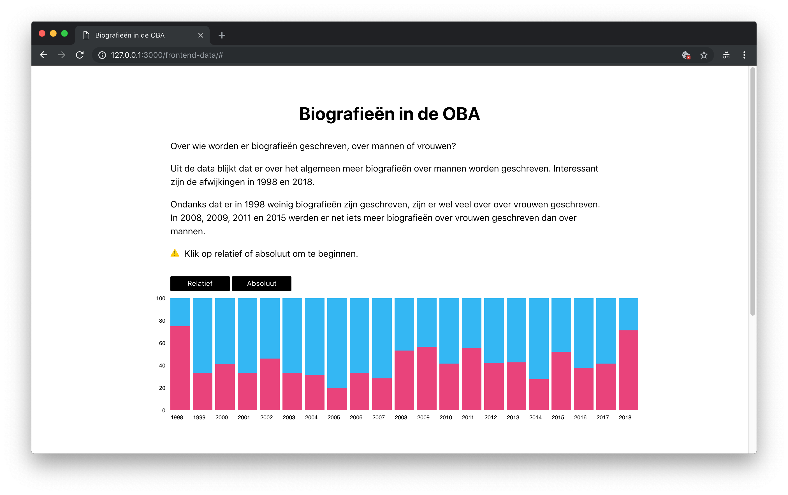

**frontend-data**

# Biografieën in de OBA

Voor het vak [Frontend Data](https://github.com/cmda-tt/course-18-19/tree/master/frontend-data) maakte ik van data, uit de [OBA](https://www.oba.nl) [API](https://zoeken.oba.nl/api/v1/), een interactieve datavisualisatie met behulp van D3.js



## Onderzoek

Tijdens het vak [Functional Programming](https://github.com/cmda-tt/course-18-19/tree/master/functional-programming) heb ik al onderzoek gedaan naar de data in de API. Voor deze datavisualisatie heb ik gefocust op alle **biografieën** in de collectie van de OBA, in het bijzonder: over wie worden er biografieën geschreven, over mannen of vrouwen?

## Data ophalen

Voor het ophalen heb ik in ieder geval de volgende data nodig: **publicatie jaar** van het boek, **auteur** en het **geslacht** van hoofdpersoon in het boek.

Ik gebruik daarvoor de volgende keys uit de API:

- `publicationyear` het jaar waarin het boek uitgekomen is.
- `summary` met de zoekwoorden **vrouw**, **haar** en **zij**, voor vrouwen en **man**, **hem** en **zijn**, voor mannen kun je uit de _summary_ halen wat het **geslacht** van de hoofdpersoon is.
- `title` in _title_ staat ook de **auteur** van het boek (achter de `/`)

Omdat het ook interessant kan zijn om bijvoorbeeld erachter te komen of mannen over mannen schrijven en vrouwen over vrouwen of juist niet, heb ik ook een `Url` van de auteur gemaakt, zodat ik deze kan gebruiken met een Wikipedia URL, bijvoorbeeld op [deze](https://medium.freecodecamp.org/the-ultimate-guide-to-web-scraping-with-node-js-daa2027dcd3) manier. Dan zou ik op kunnen halen wat het geslacht van de schrijver is. (Ben hiermee begonnen maar heb geen tijd meer gehad om dit af te maken.)

### De data

De data structuur komt er dan per boek zo uit te zien:

```json
{
  "author": "Anne Frank",
  "title": "Het Achterhuis : dagboekbrieven 12 juni 1942-1 augustus 1944",
  "summary":
    "Dagboek van een joods meisje, dat in de Tweede Wereldoorlog met haar ouders, zusje en anderen ondergedoken is in een achterhuis op een der Amsterdamse grachten. Zij spreekt zich met grote openhartigheid uit over alles wat haar van haar 13e tot haar 15e bezighoudt",
  "publicationYear": 2006,
  "gender": "female",
  "authorUrl": "Anne_Frank"
},
```

> Bekijk alle data in [data/allData.json](https://github.com/sterrevangeest/frontend-data/blob/master/data/allData.json).

> Bekijk hoe ik dit gedaan heb in [data/index.js](https://github.com/sterrevangeest/frontend-data/blob/master/data/index.js)

### Schets

Ik verwacht dat de visualisatie er ongeveer zo uit gaat zien: 

> Door snel door de data te scannen ontdekte ik dat de OBA relatief heel weinig biografieên heeft van voor het jaar 2000. Ik verwacht dat over het algemeen er meer biografieên over mannen zijn geschreven. Toch hoop iets bijzonders te zien in de verhouding tussen mannen en vrouwen. Om het verschil tussen mannen en vrouwen overzichtelijker te maken wil ik de grafiek in absolute (links) en relatieve (rechts) waardes laten zien.

## De visualisatie

Bekijk de datavisualisatie op [sterrevangeest.nl](http://sterrevangeest.nl/)

## Struggles en leerpunten

Ik dacht dat het makkelijk zou zijn als ik ongeveer dezelfde data als in het vorige vak zou gebruiken, zodat ik sneller met D3 kon beginnen. Maar achteraf ben ik blij dat ik dieper in de data gedoken ben. Daardoor heb ik o.a.:

- een veel interessanter onderwerp gevonden, wat leuker is om aan te werken.
- veel meer geleerd over en gebruik gemaakt van `Array.prototype.map()` en `Array.prototype.map()`
- dankzij Justus beter mijn bestand in leren delen
- ~~geleerd dat je nooit `console.log(error)` kwijt moet raken~~

Hierdoor heb ik wel het idee dat ik uiteindelijk minder tijd heb kunnen besteden aan het leren van D3 dan ik had gewild. Dat vind ik dan wel weer jammer. Ik heb het idee dat ik nog meer functionaliteit uit D3 had kunnen halen dan ik nu gedaan heb.

## Dankjewel 🆘

- De [Cheatsheet](https://github.com/DanielvandeVelde/functional-programming#cheatsheet) van Daniel.
- Het [node-oba-api](https://github.com/rijkvanzanten/node-oba-api) pakketje van Rijk.
- [Jesse Dijkman](https://github.com/jesseDijkman1) bij het helpen van het maken van een stacked bar chart!
