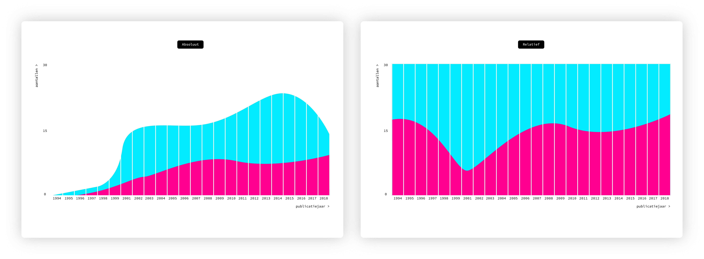

# Frontend Data

Voor het vak [Frontend Data](https://github.com/cmda-tt/course-18-19/tree/master/frontend-data) maakte ik van data, uit de [OBA](https://www.oba.nl) [API](https://zoeken.oba.nl/api/v1/), een interactieve datavisualisatie met behulp van D3.js

# Research

Tijdens het vak [Functional Programming](https://github.com/cmda-tt/course-18-19/tree/master/functional-programming) heb ik al onderzoek gedaan naar de data in de API. Voor deze datavisualisatie heb ik gefocust op alle **biografieën** in de collectie van de OBA, in het bijzonder: over wie worden er biografieën geschreven, mannen of vrouwen?

Voor het ophalen heb ik in ieder geval de volgende data nodig: **publicatie jaar** van het boek, **auteur** en het **geslacht** van hoofdpersoon in het boek.

Ik gebruik daarvoor de volgende keys uit de API:

- `publicationyear` het jaar waarin het boek uitgekomen is.
- `summary` met de zoekwoorden **vrouw**, **haar** en **zij**, voor vrouwen en **man**, **hem** en **zijn**, voor mannen kun je uit de _summary_ halen wat het **geslacht** van de hoofdpersoon is.
- `title` in _title_ staat ook de **auteur** van het boek (achter de **/** )

Omdat het ook interessant kan zijn om bijvoorbeeld erachter te komen of mannen over mannen en vrouwen over vrouwen of juist niet, heb ik ook een `Url` van de auteur gemaakt, zodat ik deze kan gebruiken met een Wikipedia URL, bijvoorbeeld op [deze](https://medium.freecodecamp.org/the-ultimate-guide-to-web-scraping-with-node-js-daa2027dcd3) manier. (Ben hiermee begonnen maar heb geen tijd meer gehad om dit af te maken.)

De data structuur komt er dan per boek zo uit te zien:

```json
{
  "author": "Anne Frank",
  "title": "Het Achterhuis : dagboekbrieven 12 juni 1942-1 augustus 1944",
  "summary":
    "Dagboek van een joods meisje, dat in de Tweede Wereldoorlog met haar ouders, zusje en anderen ondergedoken is in een achterhuis op een der Amsterdamse grachten. Zij spreekt zich met grote openhartigheid uit over alles wat haar van haar 13e tot haar 15e bezighoudt",
  "publicationYear": 2006,
  "gender": "female",
  "authorUrl": "Anne_Frank"
},
```

Bekijk alle data in [data/allData.json](https://github.com/sterrevangeest/frontend-data/blob/master/data/allData.json).

<!-- So, for this datavisualization I need the following data from the API: `year` in which the book is published , `genre` of the book and `count` in genre. -->

### Schets

Ik verwacht dat de visualisatie er ongeveer zo uit gaat zien: 

> Uitleg over wat je hier ziet!

## Hypothesis

# The datavisualization

Schets!

# Sources

- This [Cheatsheet](https://github.com/DanielvandeVelde/functional-programming#cheatsheet) by Daniel.
- This [node-oba-api](https://github.com/rijkvanzanten/node-oba-api) package by Rijk.
